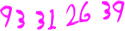

# 夜神月 (Yagami Light) : 

- Social-Media :
,
,
,

- Learning to Code at :
,
,
,
,

- Live Coding at :

- Workflow ([pics](https://github.com/ames0k0/dotfiles)) :
,
,
,
,
,
,
,

- I'm interested in : Artificial Intelligence, IoT, DevOps, InfoSec and Competitive Programming

<!--
Picture Generator: https://fontmeme.com/de/death-note-schriftart/
Lifespan: https://deathnote.fandom.com/wiki/Lifespan
-->
