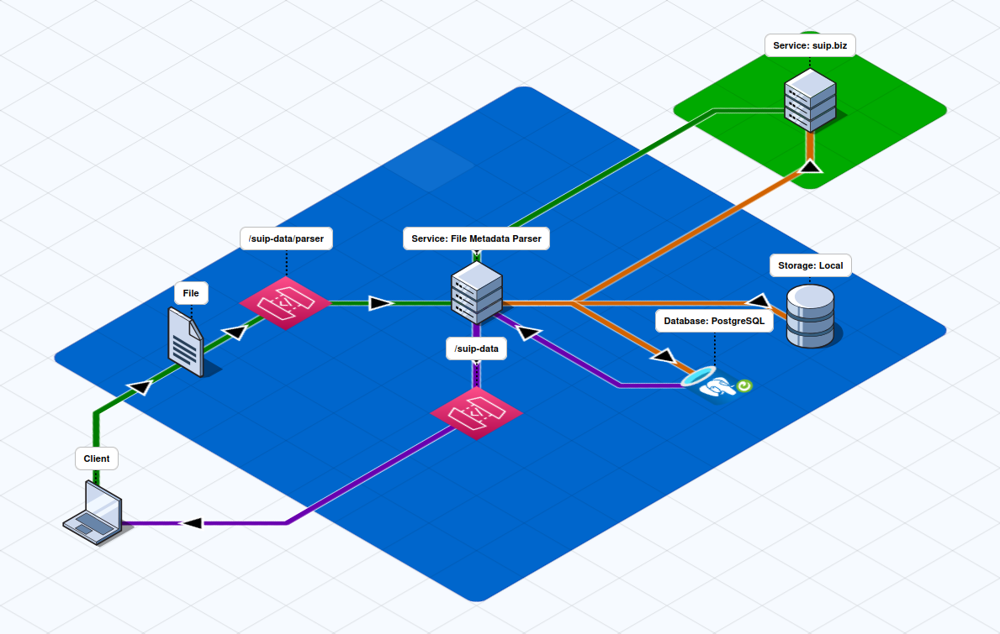
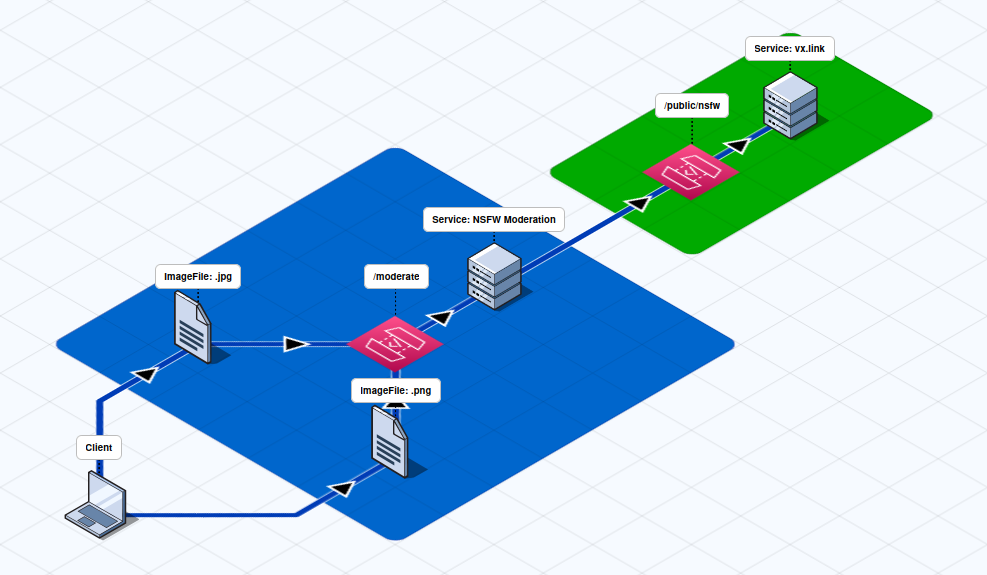

### Projects
[v0.1.0] - <a href="https://github.com/aintp3d0/TitleDiff">TitleDiff</a> 
[v0.1.0] - NyanFlow 
[v0.1.0] - <a href="https://github.com/sh1chan/Sage0x0">Sage0x0</a> 

### Services
[v0.0.2] - <a href="https://github.com/ames0k0/url-to-web-content">REST API: URL to Web Content</a> 

### Activities

  
[05.07.2025] - <a href="https://github.com/ames0k0/TT--FastAPI--File-Metadata-Parser">REST API: File Metadata Parser</a>

  REST API application that is a wrapper around a third-party service that parses file metadata 

  Tech Stack: `Python`, `FastAPI`, `Requests`, `bs4`, `PostgreSQL`, `Uvicorn`, `Docker Compose`
  

  
[03.07.2025] - <a href="https://github.com/ames0k0/TT--FastAPI--NSFW-Moderation">REST API: NSFW-Moderation</a>

  REST API application that wraps a third-party service that detects NSFW 

  Tech Stack: `Python`, `FastAPI`, `Pydantic`, `HTTPX`, `Uvicorn`
  

### Others
[Code Samples] - <a href="https://github.com/ames0k0/TestWork">TestWork</a> 
[ML Project] - <a href="https://github.com/ames0k0/datachi/blob/master/dj-lightning/test_v2.gif">DJ Lightning</a> 
