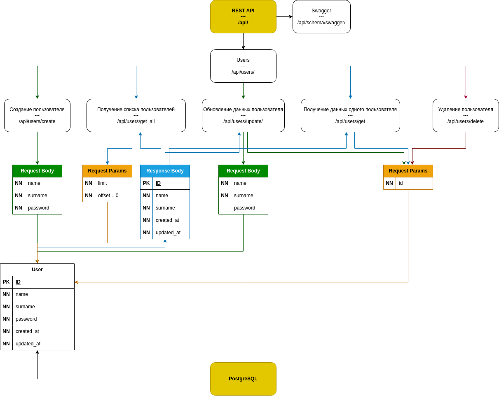

<!--
Stats example from: https://github.com/nullnyat/nullnyat
-->
<table align="center">
  <tr>
    <td></td>
    <td></td>
  </tr>
  <tr>
    <td>
      ORG:  <!-- [p]roject, [h]obby -->
      <a href="https://github.com/sh1chan">sh1chan</a>,
      <a href="https://github.com/j1bun">j1bun</a>,
      <a href="https://github.com/aintp3d0">-hobby</a>,
      <a href="https://github.com/h2b7">-forks</a>
    </td>
    <td>SNS:
      <a href="https://t.me/ames0k0">TG</a>,
      <a href="https://www.linkedin.com/in/ames0k0">IN</a>
      || YT:
        <a href="https://www.youtube.com/@ames0k0">/a</a>,
        <a href="https://www.youtube.com/channel/UCSgmAPCXUbIHugC7QmtlA8Q">/s</a>
      
    </td>
  </tr>
</table>

<table align="center">
  <tr>
    <td><strong>Projects</strong></td>
    <td>v0.1.0</td>
    <td><a href="https://github.com/aintp3d0/TitleDiff">TitleDiff</a></td>
    <td></td>
  </tr>
  <tr>
    <td></td>
    <td>v0.1.0</td>
    <td>NyanFlow</td>
    <td></td>
  </tr>
  <tr>
    <td></td>
    <td>v0.1.0</td>
    <td><a href="https://github.com/sh1chan/Sage0x0">Sage0x0</a></td>
    <td></td>
  </tr>
  <tr>
    <td><strong>Services</strong></td>
    <td>v0.0.2</td>
    <td><a href="https://github.com/ames0k0/url-to-web-content">REST API: URL to Web Content</a></td>
    <td></td>
  </tr>
  <tr>
    <td><strong>TestProjects</strong></td>
    <td>14.06.2025</td>
    <td><a href="https://github.com/ames0k0/TP--Audio-File-Converter">Full-Stack: Audio File Converter</a></td>
    <td>

  
Tech Stack

  `Python`, `FastAPI`, `DRF`, `Pydub`, `Pydantic`, `JavaScript`, `TypeScript`, `Node.js`, `React`, `Vite`, `Tailwind CSS`, `FFmpeg`, `Uvicorn`, `Gunicorn`, `Docker Compose`
  

    </td>
  </tr> 
  <tr>
    <td><strong>TestTasks</strong></td>
    <td>05.07.2025</td>
    <td><a href="https://github.com/ames0k0/TT--FastAPI--File-Metadata-Parser">REST API: File Metadata Parser</a></td>
    <td>

  
Tech Stack

  `Python`, `FastAPI`, `Requests`, `bs4`, `PostgreSQL`, `Uvicorn`, `Docker Compose`
  

    </td>
  </tr> 
  <tr>
    <td></td>
    <td>03.07.2025</td>
    <td><a href="https://github.com/ames0k0/TT--FastAPI--NSFW-Moderation">REST API: NSFW Moderation</a></td>
    <td>

  
Tech Stack

  `Python`, `FastAPI`, `Pydantic`, `HTTPX`, `Uvicorn`
  

    </td>
  </tr>
  <tr>
    <td></td>
    <td>30.05.2025</td>
    <td><a href="https://github.com/ames0k0/TT--Litestar--User-Management">REST API: User Management</a></td>
    <td>

  
Tech Stack

  `Python`, `Litestar`, `Litestar-Asyncpg`, `Litestar-Granian`, `Advanced-Alchemy`, `msgspec`, `python-dotenv`, `PostgreSQL`, `Docker Compose`
  

    </td>
  </tr><tr>
    <td><strong>Others</strong></td>
    <td>Code Samples</td>
    <td><a href="https://github.com/ames0k0/TestWork">TestWork</a></td>
    <td></td>
  </tr>
  <tr>
    <td></td>
    <td>ML Project</td>
    <td><a href="https://github.com/ames0k0/datachi/blob/master/dj-lightning/test_v2.gif">DJ Lightning</a></td>
    <td>

  
Tech Stack

  `Python`, `Scikit-learn`, `Numpy`, `Pygame`, `PyAudio`, `pydub`
  

    </td>
  </tr>
</table>
